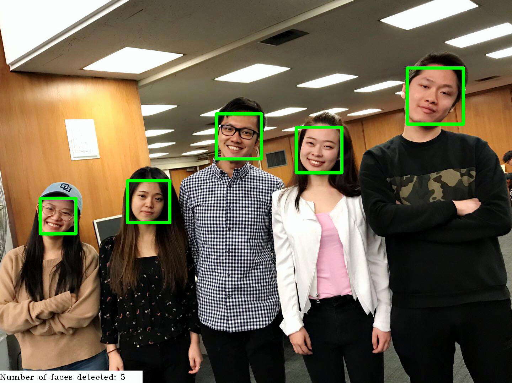

# ADS Project 5: Face Detection

**Projec title**: Face Detection

[Jupyter Notebook](doc/main.ipynb)

[Presentation](doc/)

+ Term: Spring 2018
+ Team 9
+ Team members
	+ Chen, Ziyu (zc2393@columbia.edu)
	+ Cui, Wanting (wc2619@columbia.edu)
	+ Kong, Yuehan (yk2756@columbia.edu)
	+ Lam, Leo (lkl2129@columbia.edu)
	+ Zha, Yuhan (yz3284@columbia.edu)
+ Project summary: In this project, we use a method haar to extract features. After that, applying extracted features to cascade method, we are able to dectect people's faces and also count the number of faces through pictures as well as webcam. Finally, we implement the contemporary model which can distinguish people as well as objects with confidence value through pictures and webcam. 
+ A main reproducible [presentation](https://github.com/TZstatsADS/Spring2018-Project5-grp_9/blob/master/doc/main.pdf)

**Result demonstration**


	
**Contribution statement**: Generally we did the project together during our meetings (implement face detection model and API).
+ Chen, Ziyu: Built the original model; implemented tensorflow to a contemporary model.
+ Cui, Wanting: Improved by adding rotate element.  
+ Kong, Yuehan: Tried to improve by adding upper body element; wrote and organized github page.
+ Lam, Leo: Debugged the code; wrote the main notebook.
+ Zha, Yuhan: Researched and introduced tensorflow; prepare the presentation.

Following [suggestions](http://nicercode.github.io/blog/2013-04-05-projects/) by [RICH FITZJOHN](http://nicercode.github.io/about/#Team) (@richfitz). This folder is orgarnized as follows.

```
proj/
├── lib/
├── data/
├── doc/
├── figs/
└── output/
```

Please see each subfolder for a README file.
